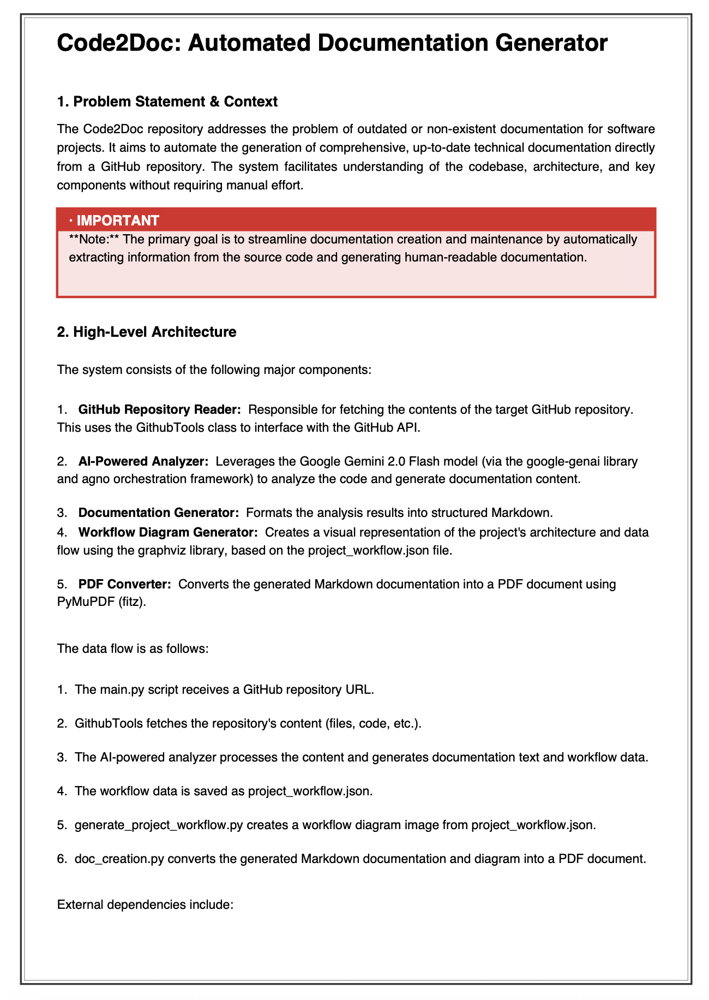
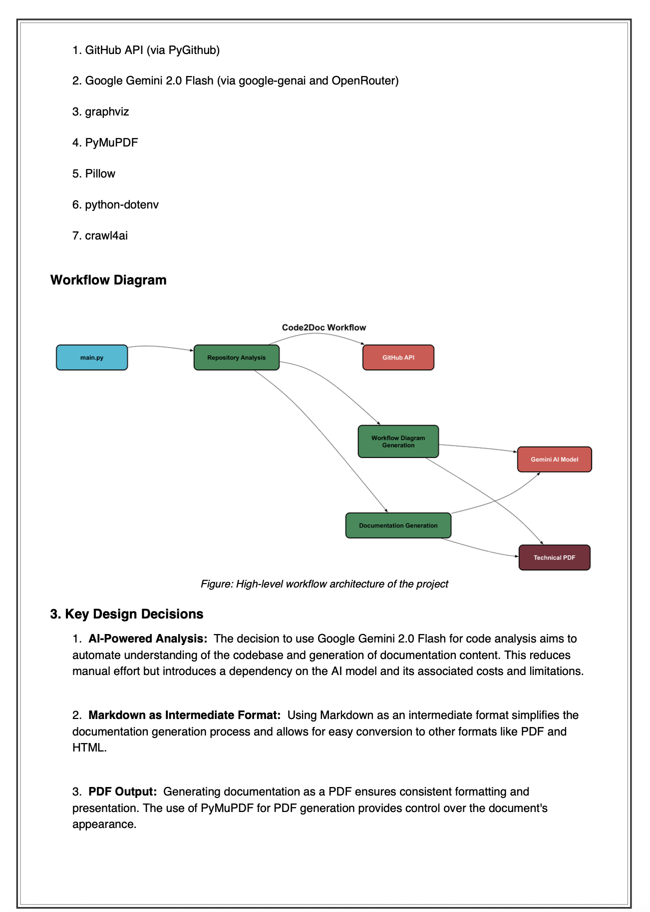
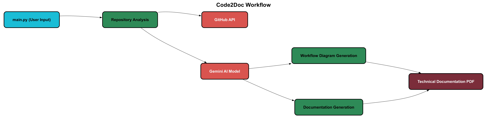

# Code2Doc: Automated Repository Documentation Generator

> **Transform any GitHub repository into comprehensive technical documentation with AI-powered workflow diagrams — automatically.**

[](LICENSE)
[](https://www.python.org/)
[](https://deepmind.google/technologies/gemini/)

---

## Overview

**Code2Doc** is an intelligent documentation generator that converts GitHub repositories into professional, structured technical documentation using AI-powered analysis. It automatically:

- **Analyzes code** using Google's Gemini 2.0 Flash model
- **Generates workflow diagrams** showing project architecture
- **Creates comprehensive documentation** with proper formatting
- **Produces professional PDFs** with embedded diagrams
- **Applies smart formatting** with headings, lists, and bold text

<p align="center">
  
  
</p>

---

## Key Features

### Intelligent Repository Analysis
- Scans entire GitHub repositories using **GithubTools**
- Identifies files, modules, functions, classes, and dependencies
- Understands code structure and relationships
- Extracts key technical information

### Automatic Workflow Diagram Generation
- Creates **high-level architectural diagrams** (5-10 nodes)
- Visualizes project workflow and data flow
- Renders professional diagrams at **300 DPI**
- Embeds diagrams directly into documentation

### Comprehensive Documentation
- Generates **Introduction** and **Conclusion** sections
- Documents **all functions, classes, and methods**
- Explains **dependencies, integrations, and workflows**
- Uses **bold formatting** for important concepts
- Properly structures content with clear headings

### Professional PDF Output
- Creates **publication-ready PDFs**
- Embeds workflow diagrams at optimal locations
- Supports **custom typography** (19.5pt headings, 11.5pt body)
- Includes **numbered lists** and proper spacing
- Handles **image embedding** and captions

---

## Workflow Architecture

Code2Doc follows this automated workflow:



**Process Flow:**
1. **main.py** — Entry point, handles user input
2. **Repository Analysis** — Analyzes GitHub repository structure
3. **GitHub API** — Fetches repository data
4. **Gemini AI Model** — Interprets code and generates documentation
5. **Documentation Generator** — Creates structured content
6. **Workflow Generator** — Produces workflow diagram JSON
7. **PDF Export** — Generates final PDF with embedded diagram
8. **Technical Documentation** — Final output files

---

## Project Structure

```
Code2Doc/
├── main.py                         # Main orchestration script
├── doc_creation.py                 # PDF generation with image embedding
├── generate_project_workflow.py   # Workflow diagram renderer
├── requirements.txt                # Python dependencies
├── pyproject.toml                  # Project configuration
├── .env                            # Environment variables (create this)
├── assets/                         # Static assets
│   ├── workflow_diagram.png        # Sample workflow diagram
│   └── code2doc_documentation_preview.png
└── examples/                       # Sample outputs
    └── technical_documentation.pdf # Example generated documentation
```

---

## Sample Output

### Generated Files

After running Code2Doc, you'll get:

| File | Description |
|------|-------------|
| `content.txt` | Markdown-formatted documentation with diagram references |
| `technical_documentation.pdf` | **Professional PDF with embedded workflow diagram** |
| `project_workflow.json` | Structured workflow data (nodes and edges) |
| `project_workflow_diagram.png` | High-resolution workflow diagram (300 DPI) |

### Example Output

**[View Sample Documentation PDF →](examples/sample_output.pdf)**

The generated documentation includes:
- **Introduction** — Project overview and context
- **Workflow Diagram** — Visual architecture (automatically inserted)
- **Architecture** — Component breakdown
- **Implementation Details** — Functions, classes, and methods
- **Dependencies** — External integrations
- **Conclusion** — Key features and takeaways

---

## Use Cases

- **Project Documentation** — Auto-generate README and technical docs
- **Code Understanding** — Quickly understand unfamiliar codebases
- **Onboarding** — Help new team members learn project structure
- **Code Review** — Get AI-powered insights into functionality
- **Legacy Code** — Document undocumented systems
- **Architecture Diagrams** — Visualize system workflows automatically

---

## Dependencies

| Package | Purpose |
|---------|---------|
| **agno** | AI agent framework for orchestration |
| **google-genai** | Google Gemini AI integration |
| **python-dotenv** | Environment variable management |
| **PyMuPDF (fitz)** | PDF generation and manipulation |
| **Pillow** | Image processing for PDF embedding |
| **graphviz** | Workflow diagram rendering |

Install all dependencies:

```bash
uv sync  # or pip install -r requirements.txt
```

---

## License

This project is licensed under the **Apache License 2.0** - see the [LICENSE](LICENSE) file for details.

---

## Contributing

Contributions are welcome! Please feel free to submit a Pull Request.

1. Fork the Project
2. Create your Feature Branch (`git checkout -b feature/AmazingFeature`)
3. Commit your Changes (`git commit -m 'Add some AmazingFeature'`)
4. Push to the Branch (`git push origin feature/AmazingFeature`)
5. Open a Pull Request

---

## Roadmap

- [x] AI-powered repository analysis
- [x] Automatic workflow diagram generation
- [x] PDF generation with embedded diagrams
- [x] Professional formatting and typography
- [ ] Multiple output formats (Markdown, HTML)
- [ ] Batch processing for multiple repositories
- [ ] Custom documentation templates
- [ ] Integration with documentation platforms (Read the Docs, GitBook)
- [ ] Interactive web UI
- [ ] Code quality metrics and analysis
- [ ] Automated documentation updates on commits
- [ ] Multi-language support (currently Python-focused)

---

<div align="center">

**Star this repository if you find it helpful!**

</div>
